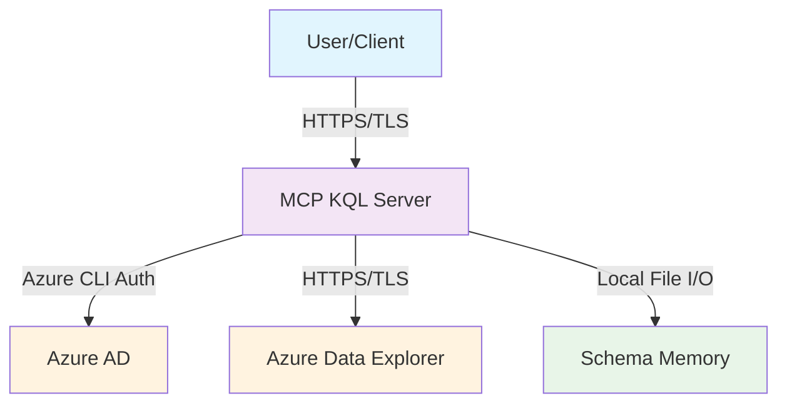
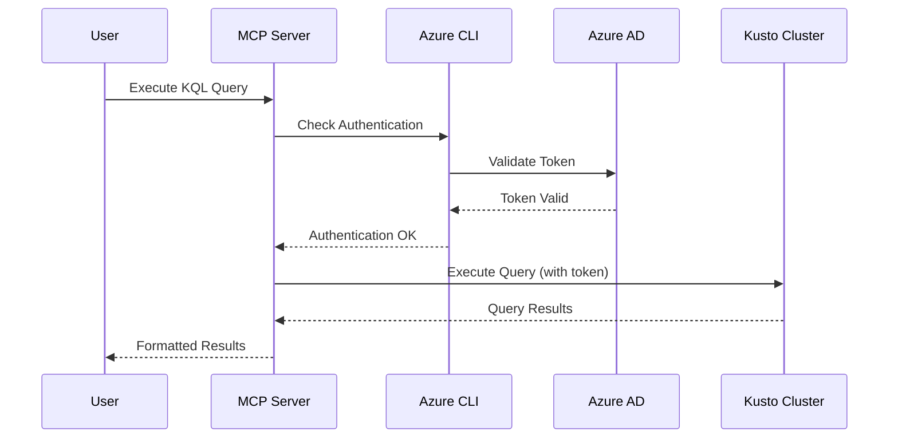

# Security Policy

> **Security First Approach** 🔒

The MCP KQL Server project takes security seriously. This document outlines our security practices, how to report vulnerabilities, and the measures we take to ensure the safety of our users' data and systems.

## 🛡️ Supported Versions

We actively maintain and provide security updates for the following versions:

| Version | Supported          | Status |
| ------- | ------------------ | ------ |
| 2.0.x   | ✅ Yes             | Active |
| 1.x.x   | ❌ No              | EOL    |

## 🚨 Reporting a Vulnerability

### How to Report

If you discover a security vulnerability, please report it responsibly:

1. **DO NOT** create a public GitHub issue
2. **Email directly**: [arjuntrivedi42@yahoo.com](mailto:arjuntrivedi42@yahoo.com)
3. **Subject**: `[SECURITY] MCP KQL Server - [Brief Description]`
4. **Include**:
   - Detailed description of the vulnerability
   - Steps to reproduce the issue
   - Potential impact assessment
   - Suggested fix (if available)
   - Your contact information

### What to Expect

- **Acknowledgment**: Within 48 hours
- **Initial Assessment**: Within 1 week
- **Regular Updates**: Every week until resolved
- **Resolution Timeline**: 
  - Critical: 7-14 days
  - High: 14-30 days
  - Medium: 30-60 days
  - Low: 60-90 days

### Responsible Disclosure

We follow responsible disclosure practices:

1. **Private notification** to our security team
2. **Collaborative investigation** and fix development
3. **Coordinated public disclosure** after fix is available
4. **Credit and recognition** to the reporter (if desired)

## 🔐 Security Measures

### Authentication & Authorization

- **Azure CLI Integration**: Leverages Microsoft's secure authentication
- **No Credential Storage**: Server doesn't store authentication tokens
- **Automatic Token Refresh**: Uses Azure's token lifecycle management
- **Least Privilege Access**: Only requests necessary permissions

### Data Protection

- **Local Memory Storage**: Schema cache stored locally only
- **No Data Transmission**: Query results not transmitted to external services
- **Encryption in Transit**: All Azure communications use HTTPS/TLS
- **Sensitive Data Masking**: Automatic masking in logs and error messages

### Input Validation

- **Query Sanitization**: Protection against KQL injection attacks
- **Parameter Validation**: Strict validation of all input parameters
- **Size Limits**: Protection against memory exhaustion attacks
- **Timeout Protection**: Prevents long-running query attacks

### Code Security

- **Dependency Scanning**: Automated vulnerability scanning with Bandit
- **Static Analysis**: Regular code security analysis
- **Secret Detection**: Automated secret scanning in CI/CD
- **Security Headers**: Appropriate security headers in HTTP responses

## 🏗️ Security Architecture

### Network Security



### Authentication Flow



## 🔍 Security Testing

### Automated Testing

- **Dependency Scanning**: Daily scans for known vulnerabilities
- **Static Code Analysis**: Pre-commit hooks and CI/CD integration
- **Secret Detection**: Automatic detection of hardcoded secrets
- **Security Headers**: Validation of security headers and configurations

### Manual Testing

- **Penetration Testing**: Regular security assessments
- **Code Reviews**: Security-focused code review process
- **Threat Modeling**: Regular threat assessment and modeling
- **Security Audits**: Periodic comprehensive security audits

## 📋 Security Checklist

### For Users

- [ ] Use latest supported version
- [ ] Keep Azure CLI updated
- [ ] Use strong authentication methods
- [ ] Regularly review access permissions
- [ ] Monitor for unusual activity
- [ ] Follow principle of least privilege

### For Developers

- [ ] Follow secure coding practices
- [ ] Use pre-commit security hooks
- [ ] Validate all inputs
- [ ] Handle errors securely
- [ ] Keep dependencies updated
- [ ] Document security considerations

## 🚫 Known Security Considerations

### Limitations

1. **Azure CLI Dependency**: Security relies on Azure CLI configuration
2. **Local Memory Storage**: Schema data stored in user-accessible files
3. **Query Execution**: Direct query execution against configured clusters
4. **Network Dependencies**: Requires network access to Azure services

### Mitigations

1. **Authentication Validation**: Regular checks of Azure CLI authentication
2. **File Permissions**: Restricted file permissions for memory storage
3. **Query Validation**: Input sanitization and query structure validation
4. **Timeout Controls**: Protection against long-running operations

## 🔧 Security Configuration

### Recommended Settings

```bash
# Environment variables for enhanced security
export AZURE_CORE_ONLY_SHOW_ERRORS=true
export KQL_DEBUG=false  # Disable debug mode in production

# Azure CLI security settings
az config set core.login_experience_v2=off
az config set core.only_show_errors=true
```

### File Permissions

```bash
# Secure memory directory permissions
chmod 700 ~/.local/share/KQL_MCP/
chmod 600 ~/.local/share/KQL_MCP/schema_memory.json
```

## 📞 Security Contacts

- **Security Team**: [arjuntrivedi42@yahoo.com](mailto:arjuntrivedi42@yahoo.com)
- **Project Maintainer**: [Arjun Trivedi](https://github.com/4R9UN)
- **GitHub Security**: Use GitHub's security advisory feature

## 🔄 Incident Response

### In Case of Security Incident

1. **Immediate Response**:
   - Assess the scope and impact
   - Contain the vulnerability
   - Notify affected users
   - Document the incident

2. **Investigation**:
   - Analyze root cause
   - Determine affected systems
   - Assess data exposure
   - Plan remediation

3. **Resolution**:
   - Develop and test fix
   - Deploy security patch
   - Verify remediation
   - Update security measures

4. **Communication**:
   - Notify users of resolution
   - Publish security advisory
   - Update documentation
   - Conduct post-incident review

## 📚 Security Resources

### Documentation

- [Azure Security Best Practices](https://docs.microsoft.com/en-us/azure/security/)
- [OWASP Top 10](https://owasp.org/www-project-top-ten/)
- [Python Security Guidelines](https://python.org/dev/security/)
- [MCP Security Considerations](https://github.com/anthropics/mcp/blob/main/docs/SECURITY.md)

### Tools

- [Bandit](https://github.com/PyCQA/bandit) - Python security linter
- [Safety](https://github.com/pyupio/safety) - Dependency vulnerability scanner
- [Azure CLI Security Commands](https://docs.microsoft.com/en-us/cli/azure/security)

## 📄 Compliance

### Standards

- **GDPR**: Data protection and privacy compliance
- **SOC 2**: Security and availability standards
- **ISO 27001**: Information security management
- **Azure Compliance**: Inherits Azure's compliance certifications

### Auditing

- Regular security audits
- Compliance assessments
- Vulnerability assessments
- Penetration testing

---

## 🙏 Acknowledgments

We thank the security community for their contributions to keeping this project secure. Special thanks to researchers who report vulnerabilities responsibly.

**Remember**: Security is everyone's responsibility. If you see something, say something.

---

*Last updated: January 2025*
*Security policy version: 2.0*